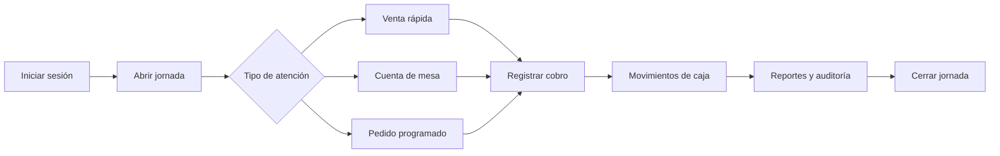

# App Sistema de Ventas — Kankachos Valeriano


Aplicación Android de ventas, atención de mesas y control de caja desarrollada para **Kankachos Valeriano**, un negocio de venta de alimentos preparados que funciona sin internet pero en un futuro poder integrar en la nube para una mayor visualizacion en tiempo real.

El sistema centraliza la operación diaria en una tablet o celular: apertura de caja, ventas rápidas, cuentas de mesa, pedidos programados, cobros, gastos, cierres, reportes y auditoría. Está diseñado para funcionar localmente sin depender de un servidor.

> **Estado:** proyecto en desarrollo. La operación principal está implementada; los respaldos administrativos y los gráficos estadísticos avanzados continúan en construcción.

## Problema que resuelve

Antes de centralizar la operación, un negocio de atención presencial puede enfrentar cuentas mezcladas, pagos parciales difíciles de seguir, diferencias de caja y pérdida del historial cuando se corrige un registro.

Esta aplicación busca reducir esos riesgos mediante:

- separación clara entre ventas, cobros y movimientos de caja;
- seguimiento de hasta dos cuentas independientes por mesa;
- pagos asociados a productos y cantidades concretas;
- jornadas de caja con apertura, gastos, validaciones y cierre;
- conservación del registro original mediante movimientos compensatorios;
- funcionamiento offline con persistencia SQLite en el dispositivo;
- permisos diferenciados para administrador y cajero.

## Funcionalidades

| Módulo              | Alcance actual                                                                                              |
| ------------------- | ----------------------------------------------------------------------------------------------------------- |
| Autenticación       | Configuración inicial, administrador, cajero, bloqueo temporal, sesión y recuperación local                 |
| Jornada de caja     | Apertura, control de jornada pendiente, efectivo inicial, cierre normal y cierre administrativo excepcional |
| Venta rápida        | Productos, cantidades, adicionales, modificación justificada de precio, efectivo, Yape y pago combinado     |
| Mesas               | Administración de mesas, hasta dos cuentas por mesa, unión y separación física sin alterar consumos         |
| Pagos separados     | Selección de productos o cantidades específicas dentro de una cuenta                                        |
| Pedidos programados | Cliente, fecha, recojo o domicilio, líneas personalizadas, adelantos, preparación, entrega y saldo          |
| Gastos              | Categoría, método de pago, importe, concepto, observación y movimiento de caja                              |
| Reportes            | Caja y ventas por jornada, exportación CSV y generación local de PDF                                         |
| Correcciones        | Movimientos compensatorios relacionados con el registro original y auditoría completa                       |
| Estadísticas        | Modelo y contrato TDD definidos; gráficos por día, semana y mes pendientes de implementación                |
| Respaldos           | Diseño aprobado; interfaz final de respaldo y restauración todavía pendiente                                |

## Flujo operativo



Las ventas y la caja se contabilizan por reglas distintas:

- **Caja:** el dinero pertenece a la jornada en la que se recibió o se gastó.
- **Ventas:** la operación pertenece a la jornada en la que se finalizó la atención o se entregó el pedido.

Esto evita duplicar una venta cuando fue pagada mediante varios cobros.

## Arquitectura

El proyecto separa interfaz, reglas de negocio y persistencia:

```text
Página o componente Ionic
        ↓
Fachada de aplicación
        ↓
Caso de uso y reglas de dominio
        ↓
Interfaz de repositorio
        ↓
Adaptador SQLite
        ↓
Base local cifrada
```

Principios aplicados:

- montos almacenados como enteros en céntimos;
- transacciones SQLite para operaciones económicas;
- claves de idempotencia para evitar registros duplicados;
- historial inmutable de operaciones confirmadas;
- correcciones económicas compensatorias en lugar de sobrescrituras;
- auditoría con usuario, fecha, hora y relación con el registro afectado;
- autorización verificada en los casos de uso, no solo en la interfaz.

## Tecnologías

| Tecnología                 |   Versión | Uso                             |
| -------------------------- | --------: | ------------------------------- |
| Angular                    |   21.2.18 | Aplicación y componentes        |
| Ionic Angular              |    8.8.15 | Interfaz táctil responsive      |
| Capacitor                  |     8.4.2 | Integración Android             |
| Capacitor Community SQLite |     8.1.0 | Persistencia local cifrada      |
| TypeScript                 |     5.9.3 | Código de aplicación y dominio  |
| Vitest                     |    4.1.10 | Pruebas unitarias e integración |
| hash-wasm                  |    4.12.0 | Credenciales Argon2id           |
| Android SDK                | API 26–36 | Android 8.0 como versión mínima |

Identificador Android: `pe.kankachosvaleriano.app`.

## Estructura del proyecto

```text
src/app/core       Adaptadores SQLite, sesión e infraestructura
src/app/domain     Modelos, reglas, contratos y casos de uso
src/app/features   Pantallas y componentes por funcionalidad
src/app/shared     Elementos reutilizables
tests/sqlite       Pruebas de integración con SQLite real en memoria
android            Proyecto nativo administrado por Capacitor
docs               Especificaciones y decisiones permanentes
```

## Requisitos

- Node.js `22.12` o posterior, menor que `23`.
- npm `10.9.x`.
- Java `21`.
- Android Studio.
- Android SDK Platform `36`.

## Instalación y ejecución web

```powershell
git clone https://github.com/antony87-1/app-sistema-de-ventas.git
cd app-sistema-de-ventas
npm.cmd install
npm.cmd start
```

La vista web sirve para desarrollo de interfaz. La persistencia cifrada debe validarse en Android mediante Capacitor.

## Ejecución en Android

```powershell
npm.cmd run android:sync
```

Después:

1. Abrir la carpeta `android` en Android Studio.
2. Esperar la sincronización de Gradle.
3. Seleccionar un emulador o dispositivo Android.
4. Ejecutar la aplicación con **Run**.

Para generar el APK de depuración desde PowerShell:

```powershell
npm.cmd run android:build:debug
```

## Pruebas

```powershell
npm.cmd run test:all
```

La suite combina pruebas Angular y pruebas de integración contra SQLite real en memoria. La última verificación registrada aprobó:

- 153 pruebas Angular;
- 111 pruebas SQLite;
- 264 pruebas activas en total;
- 6 contratos TDD de estadísticas omitidos hasta aprobar su implementación.

También están disponibles:

```powershell
npm.cmd run test:ci
npm.cmd run test:sqlite
npm.cmd run build
npm.cmd run format:check
```

## Documentación técnica

- [Contexto y estado del proyecto](docs/CONTEXTO_PROYECTO.md)
- [Modelo de datos](docs/MODELO_DATOS.md)
- [Esquema lógico SQLite](docs/ESQUEMA_LOGICO_SQLITE.md)
- [Autorización y permisos](docs/AUTORIZACION.md)
- [Credenciales y aprovisionamiento](docs/CREDENCIALES.md)
- [SQLite, cifrado y respaldos](docs/SQLITE_Y_RESPALDOS.md)
- [Frontend de atención](docs/FRONTEND_ATENCION.md)
- [Diseño de reportes estadísticos](docs/REPORTES_ESTADISTICOS.md)
- [Recuperación de contraseña](docs/GUIA_RECUPERACION_CONTRASENA.md)

## Próximas etapas

- respaldos locales y restauración administrativa controlada;
- agrupación estadística diaria en intervalos de treinta minutos;
- reportes comparativos por semana y mes;
- gráficos responsive para tablet y celular;
- validación adicional en dispositivo físico Android 8.0 o superior.

## Seguridad del repositorio

El repositorio no contiene usuarios, contraseñas, bases de datos ni claves de firma de producción. Los archivos `.env`, configuraciones locales, bases SQLite, respaldos y certificados Android están excluidos mediante `.gitignore`.

Actualmente la aplicación no requiere variables de entorno. Cuando exista una configuración externa real, se documentará mediante `.env.example` con valores ficticios.

## Licencia

Este repositorio todavía no incluye una licencia de código abierto. Su publicación permite revisar el desarrollo, pero no concede automáticamente derechos de uso, modificación o distribución.
