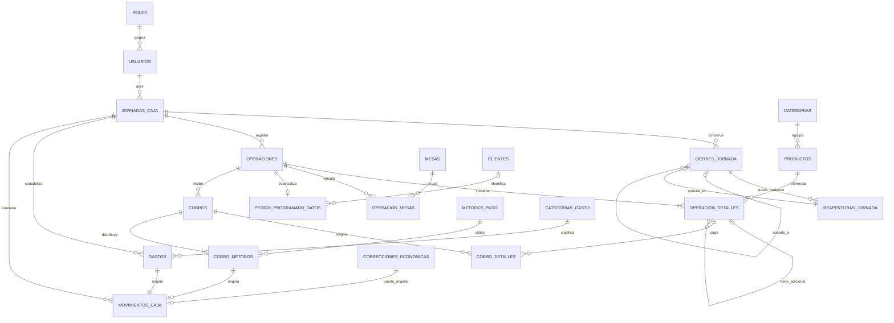
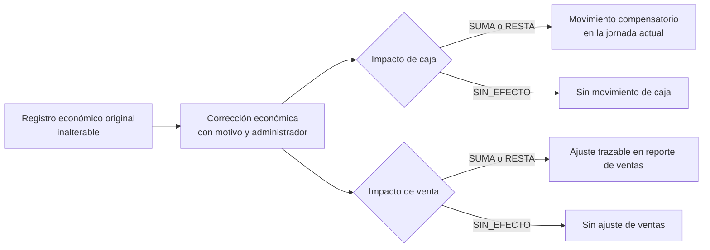

# Esquema lógico SQLite

## 1. Estado y alcance

- Estado: **aprobado e implementado mediante las migraciones versiones 1 a 5**.
- Versión: 0.5.0.
- Fecha: 2026-07-29.
- Base: modelo conceptual 0.2.0 y decisiones económicas aprobadas el 2026-07-29.
- Alcance: tablas, columnas, tipos SQLite, claves, restricciones, relaciones, índices y validaciones transaccionales.
- Fuera de alcance del contrato: sentencias SQL, instalación del plugin SQLite y acceso desde repositorios. La implementación física se referencia en la sección 17.

Este documento conserva el contrato lógico que originó la migración. Por sí mismo no crea ni modifica una base de datos.

## 2. Convenciones físicas

### 2.1 Identidad, tiempo y dinero

- Las claves primarias de negocio son UUID v7 generados por la aplicación y guardados como `TEXT`.
- Las fechas de negocio se guardan como `TEXT` en formato `YYYY-MM-DD`, calculadas en la zona `America/Lima`.
- Los instantes históricos se guardan como `TEXT` ISO 8601 en UTC, con sufijo `Z`.
- La hora programada conserva además la zona horaria y el valor local solicitado por el cliente.
- Todo dinero se guarda como `INTEGER` de céntimos, nunca como `REAL`.
- Las cantidades de productos son `INTEGER`; la primera versión no admite fracciones.
- Los booleanos son `INTEGER` restringidos a `0` o `1`.
- Los enumerados son `TEXT` con un conjunto cerrado de valores.
- Las instantáneas y registros económicos confirmados no se eliminan ni sobrescriben.

### 2.2 Compatibilidad SQLite

El primer esquema no dependerá de `STRICT`, columnas generadas ni de la extensión JSON1 hasta verificar el motor incluido por el plugin y el dispositivo API 26. La aplicación validará UUID, fechas y JSON canónico. Cada conexión deberá activar claves foráneas.

### 2.3 Nombres y nulabilidad

- Tablas y columnas: `snake_case`, en singular para las columnas y plural para las tablas.
- Toda columna es obligatoria salvo que se marque explícitamente como opcional.
- Las claves foráneas históricas usan eliminación restringida.
- Catálogos y usuarios se desactivan con `activo`; no se eliminan si tienen historial.

## 3. Diagrama lógico general



## 4. Tablas de identidad y configuración

### 4.1 `roles`

| Columna         | Tipo      | Regla                              |
| --------------- | --------- | ---------------------------------- |
| `id`            | `TEXT`    | PK, UUID v7.                       |
| `codigo`        | `TEXT`    | Único; `ADMINISTRADOR` o `CAJERO`. |
| `nombre`        | `TEXT`    | No vacío.                          |
| `activo`        | `INTEGER` | `0` o `1`.                         |
| `creado_en_utc` | `TEXT`    | Instante automático.               |

Índice: único por `codigo`. Los permisos permanecen en el dominio; no se crea una tabla configurable de permisos.

### 4.2 `usuarios`

| Columna                      | Tipo      | Regla                                     |
| ---------------------------- | --------- | ----------------------------------------- |
| `id`                         | `TEXT`    | PK.                                       |
| `rol_id`                     | `TEXT`    | FK a `roles`, eliminación restringida.    |
| `nombre_usuario`             | `TEXT`    | Valor visible, no vacío.                  |
| `nombre_usuario_normalizado` | `TEXT`    | Único, calculado por la aplicación.       |
| `nombre_mostrar`             | `TEXT`    | No vacío.                                 |
| `contrasena_hash`            | `TEXT`    | Hash seguro, nunca texto plano.           |
| `contrasena_sal`             | `TEXT`    | Sal individual.                           |
| `contrasena_algoritmo`       | `TEXT`    | Identificador y parámetros del algoritmo. |
| `activo`                     | `INTEGER` | `0` o `1`.                                |
| `creado_en_utc`              | `TEXT`    | Obligatorio.                              |
| `actualizado_en_utc`         | `TEXT`    | Obligatorio.                              |

Índices: único por `nombre_usuario_normalizado`; índice por `rol_id, activo`.

### 4.3 `configuracion`

| Columna                      | Tipo   | Regla                                   |
| ---------------------------- | ------ | --------------------------------------- |
| `clave`                      | `TEXT` | PK, no vacía.                           |
| `valor`                      | `TEXT` | Obligatorio.                            |
| `tipo_valor`                 | `TEXT` | `TEXTO`, `ENTERO`, `BOOLEANO` o `JSON`. |
| `descripcion`                | `TEXT` | Opcional.                               |
| `actualizado_por_usuario_id` | `TEXT` | FK a `usuarios`.                        |
| `actualizado_en_utc`         | `TEXT` | Obligatorio.                            |

El dominio valida el valor según `tipo_valor`; el esquema no depende de JSON1.

### 4.4 `schema_version`

| Columna           | Tipo      | Regla                             |
| ----------------- | --------- | --------------------------------- |
| `version`         | `INTEGER` | PK, mayor que cero.               |
| `nombre`          | `TEXT`    | No vacío.                         |
| `checksum`        | `TEXT`    | SHA-256 del archivo de migración. |
| `aplicada_en_utc` | `TEXT`    | Obligatorio.                      |
| `duracion_ms`     | `INTEGER` | Cero o mayor.                     |

La tabla conservará una fila por migración aplicada. La versión 1 registra `initial_schema` y el checksum SHA-256 del conjunto de sentencias estructurales.

## 5. Catálogo

### 5.1 `categorias`

| Columna              | Tipo      | Regla            |
| -------------------- | --------- | ---------------- |
| `id`                 | `TEXT`    | PK.              |
| `codigo`             | `TEXT`    | Único, no vacío. |
| `nombre`             | `TEXT`    | No vacío.        |
| `nombre_normalizado` | `TEXT`    | Único.           |
| `orden`              | `INTEGER` | Cero o mayor.    |
| `activo`             | `INTEGER` | `0` o `1`.       |
| `creado_en_utc`      | `TEXT`    | Obligatorio.     |
| `actualizado_en_utc` | `TEXT`    | Obligatorio.     |

Índice de listado: `activo, orden, nombre_normalizado`.

### 5.2 `productos`

| Columna                      | Tipo      | Regla                                                     |
| ---------------------------- | --------- | --------------------------------------------------------- |
| `id`                         | `TEXT`    | PK.                                                       |
| `categoria_id`               | `TEXT`    | FK a `categorias`, eliminación restringida.               |
| `codigo`                     | `TEXT`    | Único, no vacío.                                          |
| `nombre`                     | `TEXT`    | No vacío.                                                 |
| `nombre_normalizado`         | `TEXT`    | No vacío.                                                 |
| `descripcion`                | `TEXT`    | Opcional, no vacía cuando existe.                         |
| `marca`                      | `TEXT`    | Opcional, principalmente para bebidas.                    |
| `presentacion`               | `TEXT`    | Opcional, no vacía cuando existe.                         |
| `contenido_cantidad`         | `INTEGER` | Opcional, mayor que cero.                                 |
| `unidad_medida`              | `TEXT`    | Opcional: `PORCION`, `ML` o `TAZA`.                       |
| `tipo_envase`                | `TEXT`    | Opcional hasta confirmación física.                       |
| `precio_centimos`            | `INTEGER` | Cero o mayor.                                             |
| `es_adicional`               | `INTEGER` | `0` o `1`.                                                |
| `disponibilidad`             | `TEXT`    | `DISPONIBLE` o `AGOTADO`.                                 |
| `activo`                     | `INTEGER` | `0` o `1`.                                                |
| `permite_adicionales`        | `INTEGER` | `0` o `1`; inicialmente solo kankacho.                    |
| `permite_modificar_precio`   | `INTEGER` | `0` o `1`; inicialmente solo kankacho.                    |
| `orden`                      | `INTEGER` | Cero o mayor.                                             |
| `creado_en_utc`              | `TEXT`    | Obligatorio.                                              |
| `actualizado_en_utc`         | `TEXT`    | Obligatorio.                                              |
| `actualizado_por_usuario_id` | `TEXT`    | FK opcional a `usuarios`; registra el último responsable. |

Índices: único por `codigo`; índice por `categoria_id, activo, disponibilidad, nombre_normalizado`; índice por `es_adicional, activo`; listado de venta por categoría, estado y orden; consulta por marca, contenido y unidad.

### 5.3 `producto_imagenes`

Cada reemplazo conserva la imagen anterior como historial. La ruta apunta a almacenamiento local administrado por la aplicación y la base guarda sus metadatos verificables.

| Columna                   | Tipo      | Regla                                            |
| ------------------------- | --------- | ------------------------------------------------ |
| `id`                      | `TEXT`    | PK.                                              |
| `producto_id`             | `TEXT`    | FK a `productos`, eliminación restringida.       |
| `ruta_local`              | `TEXT`    | Única, no vacía.                                 |
| `tipo_mime`               | `TEXT`    | `image/webp`, `image/jpeg` o `image/png`.        |
| `ancho_px`, `alto_px`     | `INTEGER` | Mayores que cero.                                |
| `tamano_bytes`            | `INTEGER` | Mayor que cero.                                  |
| `checksum_sha256`         | `TEXT`    | 64 caracteres.                                   |
| `activa`                  | `INTEGER` | `0` o `1`; solo una imagen vigente por producto. |
| `creada_por_usuario_id`   | `TEXT`    | FK opcional a `usuarios`.                        |
| `creada_en_utc`           | `TEXT`    | Obligatorio.                                     |
| `retirada_por_usuario_id` | `TEXT`    | FK opcional a `usuarios`.                        |
| `retirada_en_utc`         | `TEXT`    | Obligatorio cuando la imagen ya no está activa.  |

Índices: único parcial por `producto_id` cuando `activa = 1`; historial por producto y fecha de creación.

### 5.4 `mesas`

| Columna              | Tipo      | Regla                           |
| -------------------- | --------- | ------------------------------- |
| `id`                 | `TEXT`    | PK.                             |
| `codigo`             | `TEXT`    | Único, por ejemplo `MESA_04`.   |
| `nombre`             | `TEXT`    | No vacío, por ejemplo `Mesa 4`. |
| `orden`              | `INTEGER` | Cero o mayor.                   |
| `activo`             | `INTEGER` | `0` o `1`.                      |
| `creado_en_utc`      | `TEXT`    | Obligatorio.                    |
| `actualizado_en_utc` | `TEXT`    | Obligatorio.                    |

La disponibilidad es derivada de asociaciones activas; no se guarda un estado ocupada/libre que pueda desincronizarse.

### 5.5 `clientes`

| Columna                | Tipo      | Regla        |
| ---------------------- | --------- | ------------ |
| `id`                   | `TEXT`    | PK.          |
| `nombre`               | `TEXT`    | No vacío.    |
| `telefono`             | `TEXT`    | Opcional.    |
| `telefono_normalizado` | `TEXT`    | Opcional.    |
| `activo`               | `INTEGER` | `0` o `1`.   |
| `creado_en_utc`        | `TEXT`    | Obligatorio. |
| `actualizado_en_utc`   | `TEXT`    | Obligatorio. |

Índices: `telefono_normalizado`; `nombre, activo`. Los pedidos conservan instantáneas y no dependen de que el cliente siga activo.

### 5.6 `metodos_pago`

| Columna          | Tipo      | Regla                                           |
| ---------------- | --------- | ----------------------------------------------- |
| `id`             | `TEXT`    | PK.                                             |
| `codigo`         | `TEXT`    | Único; inicialmente `EFECTIVO` y `YAPE`.        |
| `nombre`         | `TEXT`    | No vacío.                                       |
| `permite_vuelto` | `INTEGER` | `0` o `1`; solo efectivo en la versión inicial. |
| `orden`          | `INTEGER` | Cero o mayor.                                   |
| `activo`         | `INTEGER` | `0` o `1`.                                      |

Índice de listado: `activo, orden`.

### 5.7 `categorias_gasto`

| Columna              | Tipo      | Regla         |
| -------------------- | --------- | ------------- |
| `id`                 | `TEXT`    | PK.           |
| `codigo`             | `TEXT`    | Único.        |
| `nombre`             | `TEXT`    | No vacío.     |
| `nombre_normalizado` | `TEXT`    | Único.        |
| `activo`             | `INTEGER` | `0` o `1`.    |
| `orden`              | `INTEGER` | Cero o mayor. |
| `creado_en_utc`      | `TEXT`    | Obligatorio.  |
| `actualizado_en_utc` | `TEXT`    | Obligatorio.  |

Índice de listado: `activo, orden, nombre_normalizado`.

## 6. Jornada y cierres

### 6.1 `jornadas_caja`

| Columna                  | Tipo      | Regla                                               |
| ------------------------ | --------- | --------------------------------------------------- |
| `id`                     | `TEXT`    | PK.                                                 |
| `fecha_negocio`          | `TEXT`    | Única, formato local `YYYY-MM-DD`.                  |
| `estado`                 | `TEXT`    | `ABIERTA` o `CERRADA`.                              |
| `monto_inicial_centimos` | `INTEGER` | Cero o mayor.                                       |
| `abierta_por_usuario_id` | `TEXT`    | FK a `usuarios`.                                    |
| `abierta_en_utc`         | `TEXT`    | Obligatorio.                                        |
| `observacion_apertura`   | `TEXT`    | Opcional.                                           |
| `clave_idempotencia`     | `TEXT`    | Única.                                              |
| `version`                | `INTEGER` | Mayor o igual que uno, para concurrencia optimista. |

Índices: único parcial que permite una sola fila con `estado = ABIERTA`; único por `fecha_negocio`; consulta por `estado, fecha_negocio`.

La apertura se bloquea si existe cualquier jornada abierta, incluida una fecha anterior. El cierre excepcional de una jornada anterior pertenece al flujo administrativo, no crea una segunda jornada.

### 6.2 `cierres_jornada`

| Columna                      | Tipo      | Regla                                                   |
| ---------------------------- | --------- | ------------------------------------------------------- |
| `id`                         | `TEXT`    | PK.                                                     |
| `jornada_id`                 | `TEXT`    | FK a `jornadas_caja`.                                   |
| `cierre_anterior_id`         | `TEXT`    | FK opcional a `cierres_jornada`.                        |
| `reapertura_id`              | `TEXT`    | FK opcional y única a `reaperturas_jornada`.            |
| `secuencia`                  | `INTEGER` | Mayor que cero; única dentro de la jornada.             |
| `tipo`                       | `TEXT`    | `NORMAL`, `EXCEPCIONAL` o `CORREGIDO`.                  |
| `realizado_por_usuario_id`   | `TEXT`    | FK a `usuarios`.                                        |
| `cerrado_en_utc`             | `TEXT`    | Generado al confirmar.                                  |
| `efectivo_esperado_centimos` | `INTEGER` | Cero o mayor; instantánea calculada.                    |
| `efectivo_real_centimos`     | `INTEGER` | Cero o mayor.                                           |
| `tipo_diferencia`            | `TEXT`    | `CUADRA`, `SOBRANTE` o `FALTANTE`.                      |
| `diferencia_centimos`        | `INTEGER` | Cero o mayor.                                           |
| `justificacion`              | `TEXT`    | Obligatoria si hay diferencia o el tipo no es `NORMAL`. |
| `clave_idempotencia`         | `TEXT`    | Única.                                                  |

Restricciones: `CUADRA` exige diferencia cero; `SOBRANTE` y `FALTANTE` exigen diferencia mayor que cero; el primer cierre tiene secuencia 1 y no tiene anterior ni reapertura; un cierre `CORREGIDO` referencia el cierre previo y la reapertura que lo habilitó, todos de la misma jornada. Índices: único `jornada_id, secuencia`; `jornada_id, cerrado_en_utc`; `cierre_anterior_id`; único por `reapertura_id` cuando no sea nulo.

### 6.3 `reaperturas_jornada`

| Columna                    | Tipo   | Regla                                    |
| -------------------------- | ------ | ---------------------------------------- |
| `id`                       | `TEXT` | PK.                                      |
| `jornada_id`               | `TEXT` | FK a `jornadas_caja`.                    |
| `cierre_reabierto_id`      | `TEXT` | FK única a `cierres_jornada`.            |
| `reabierta_por_usuario_id` | `TEXT` | FK a `usuarios`; debe ser administrador. |
| `motivo`                   | `TEXT` | Obligatorio, no vacío.                   |
| `reabierta_en_utc`         | `TEXT` | Obligatorio.                             |
| `clave_idempotencia`       | `TEXT` | Única.                                   |

La transacción verifica que el cierre sea el último de la misma jornada, cambia la jornada a `ABIERTA` y crea auditoría. Una reapertura solo puede desembocar en un cierre corregido. Índices: `jornada_id, reabierta_en_utc`; único por `cierre_reabierto_id`.

## 7. Operaciones, mesas y detalles

### 7.1 `operaciones`

| Columna                      | Tipo      | Regla                                                                 |
| ---------------------------- | --------- | --------------------------------------------------------------------- |
| `id`                         | `TEXT`    | PK.                                                                   |
| `codigo`                     | `TEXT`    | Único, legible por el negocio.                                        |
| `tipo`                       | `TEXT`    | `VENTA_RAPIDA`, `CUENTA_MESA` o `PEDIDO_PROGRAMADO`.                  |
| `estado`                     | `TEXT`    | `ABIERTA`, `PAGADA_PARCIALMENTE`, `PAGADA`, `FINALIZADA` o `ANULADA`. |
| `jornada_creacion_id`        | `TEXT`    | FK a `jornadas_caja`.                                                 |
| `jornada_venta_id`           | `TEXT`    | FK opcional a `jornadas_caja`; reconocimiento comercial.              |
| `creada_por_usuario_id`      | `TEXT`    | FK a `usuarios`.                                                      |
| `creada_en_utc`              | `TEXT`    | Obligatorio.                                                          |
| `finalizada_por_usuario_id`  | `TEXT`    | FK opcional a `usuarios`.                                             |
| `finalizada_en_utc`          | `TEXT`    | Opcional.                                                             |
| `subtotal_catalogo_centimos` | `INTEGER` | Cero o mayor.                                                         |
| `descuento_total_centimos`   | `INTEGER` | Cero o mayor; derivado de detalles.                                   |
| `total_centimos`             | `INTEGER` | Cero o mayor.                                                         |
| `pagado_centimos`            | `INTEGER` | Cero o mayor.                                                         |
| `saldo_centimos`             | `INTEGER` | Cero o mayor.                                                         |
| `nota`                       | `TEXT`    | Opcional.                                                             |
| `anulada_por_usuario_id`     | `TEXT`    | FK opcional a `usuarios`.                                             |
| `anulada_en_utc`             | `TEXT`    | Opcional.                                                             |
| `motivo_anulacion`           | `TEXT`    | Opcional; obligatorio al anular.                                      |
| `clave_idempotencia`         | `TEXT`    | Única para la creación.                                               |
| `version`                    | `INTEGER` | Mayor o igual que uno.                                                |

Restricciones locales: `saldo_centimos = total_centimos - pagado_centimos`; `pagado_centimos <= total_centimos`; `FINALIZADA` exige jornada, usuario e instante de finalización; `ANULADA` exige usuario, instante y motivo. Índices: `tipo, estado, creada_en_utc`; `jornada_creacion_id`; `jornada_venta_id, finalizada_en_utc`; `estado, saldo_centimos`.

### 7.2 Regla definitiva de descuentos

No existe un descuento global sin asignación. Cada detalle conserva precio de catálogo y precio aplicado. Para aplicar un precio distinto solo a algunas unidades se crea otro detalle del mismo producto y cantidad con ese precio. Así, cada pago separado conoce exactamente el precio de las unidades seleccionadas.

```text
subtotal_catalogo_centimos = suma(cantidad_total × precio_catalogo_unitario_centimos)
total_centimos = suma(cantidad_total × precio_aplicado_unitario_centimos)
descuento_total_centimos = suma de reducciones marcadas como DESCUENTO
```

`descuento_total_centimos` es una instantánea derivada para lectura y control; debe coincidir con sus detalles dentro de la misma transacción.

### 7.3 `operacion_detalles`

| Columna                             | Tipo      | Regla                                                |
| ----------------------------------- | --------- | ---------------------------------------------------- |
| `id`                                | `TEXT`    | PK.                                                  |
| `operacion_id`                      | `TEXT`    | FK a `operaciones`.                                  |
| `producto_id`                       | `TEXT`    | FK a `productos`, eliminación restringida.           |
| `detalle_principal_id`              | `TEXT`    | FK opcional al detalle padre de la misma operación.  |
| `producto_nombre_snapshot`          | `TEXT`    | No vacío.                                            |
| `categoria_nombre_snapshot`         | `TEXT`    | No vacío.                                            |
| `cantidad_total`                    | `INTEGER` | Mayor que cero.                                      |
| `cantidad_servida`                  | `INTEGER` | Entre cero y `cantidad_total`.                       |
| `cantidad_pagada`                   | `INTEGER` | Entre cero y `cantidad_total`.                       |
| `precio_catalogo_unitario_centimos` | `INTEGER` | Cero o mayor.                                        |
| `precio_aplicado_unitario_centimos` | `INTEGER` | Cero o mayor.                                        |
| `tipo_ajuste_precio`                | `TEXT`    | `NINGUNO`, `DESCUENTO` o `PRECIO_PERSONALIZADO`.     |
| `motivo_ajuste_precio`              | `TEXT`    | Obligatorio si el tipo no es `NINGUNO`.              |
| `ajustado_por_usuario_id`           | `TEXT`    | FK opcional a `usuarios`; obligatorio si hay ajuste. |
| `subtotal_centimos`                 | `INTEGER` | Igual a cantidad por precio aplicado.                |
| `estado_servicio`                   | `TEXT`    | `PENDIENTE` o `SERVIDO`.                             |
| `nota`                              | `TEXT`    | Opcional.                                            |
| `agregado_por_usuario_id`           | `TEXT`    | FK a `usuarios`.                                     |
| `agregado_en_utc`                   | `TEXT`    | Obligatorio.                                         |

Claves: unicidad auxiliar `id, operacion_id`; FK compuesta `detalle_principal_id, operacion_id` hacia esa misma pareja, para impedir adicionales en otra operación. La FK hija usa eliminación en cascada únicamente para permitir borrar un conjunto todavía no servido dentro de una transacción; cualquier detalle servido, pagado o de operación finalizada se bloquea en el dominio.

Restricciones: `NINGUNO` exige precios iguales y sin motivo; `DESCUENTO` exige precio aplicado menor al de catálogo; un adicional no puede apuntarse a sí mismo. El dominio limita la profundidad a un nivel y exige que el producto hijo esté marcado como adicional. Índices: `operacion_id, agregado_en_utc`; `detalle_principal_id`; `producto_id`; `operacion_id, cantidad_pagada, cantidad_total`.

### 7.4 `operacion_mesas`

| Columna                    | Tipo   | Regla                      |
| -------------------------- | ------ | -------------------------- |
| `id`                       | `TEXT` | PK.                        |
| `operacion_id`             | `TEXT` | FK a `operaciones`.        |
| `mesa_id`                  | `TEXT` | FK a `mesas`.              |
| `rol_mesa`                 | `TEXT` | `PRINCIPAL` o `VINCULADA`. |
| `vinculada_por_usuario_id` | `TEXT` | FK a `usuarios`.           |
| `vinculada_en_utc`         | `TEXT` | Obligatorio.               |
| `liberada_por_usuario_id`  | `TEXT` | FK opcional a `usuarios`.  |
| `liberada_en_utc`          | `TEXT` | Opcional.                  |

Restricciones: liberador e instante son ambos nulos o ambos presentes. Se conserva una sola mesa principal activa por operación. El dominio permite como máximo dos asociaciones activas de cuentas distintas para una misma mesa y bloquea una tercera dentro de una transacción. Índices históricos: `operacion_id, vinculada_en_utc`; `mesa_id, vinculada_en_utc`.

La migración v3 retiró `ux_operacion_mesas_mesa_activa`. Dos triggers transaccionales permiten hasta dos asociaciones activas para la misma mesa y abortan una inserción o reactivación adicional con `TABLE_ACTIVE_ACCOUNT_LIMIT`.

El dominio exige al menos una asociación activa y exactamente una principal para una `CUENTA_MESA`; los demás tipos no admiten asociaciones. Separar una mesa completa los campos de liberación y no mueve productos ni cobros.

### 7.5 `pedido_programado_datos`

| Columna                     | Tipo   | Regla                                                                                         |
| --------------------------- | ------ | --------------------------------------------------------------------------------------------- |
| `operacion_id`              | `TEXT` | PK y FK a `operaciones`.                                                                      |
| `cliente_id`                | `TEXT` | FK opcional a `clientes`.                                                                     |
| `cliente_nombre_snapshot`   | `TEXT` | No vacío.                                                                                     |
| `cliente_telefono_snapshot` | `TEXT` | No vacío.                                                                                     |
| `entrega_programada_local`  | `TEXT` | Fecha y hora local solicitada.                                                                |
| `zona_horaria`              | `TEXT` | Inicialmente `America/Lima`.                                                                  |
| `tipo_entrega`              | `TEXT` | `RECOJO` o `DOMICILIO`.                                                                       |
| `direccion_snapshot`        | `TEXT` | Obligatoria para domicilio.                                                                   |
| `referencia_snapshot`       | `TEXT` | Opcional.                                                                                     |
| `estado_preparacion`        | `TEXT` | `REGISTRADO`, `PENDIENTE_DE_PREPARACION`, `EN_PREPARACION`, `LISTO`, `ENTREGADO` o `ANULADO`. |
| `estado_pago`               | `TEXT` | Estado económico definido en 7.6.                                                             |
| `motivo_bloqueo_pago`       | `TEXT` | Obligatorio solo en revisión.                                                                 |
| `entregado_por_usuario_id`  | `TEXT` | FK opcional a `usuarios`.                                                                     |
| `entregado_en_utc`          | `TEXT` | Opcional.                                                                                     |
| `nota_entrega`              | `TEXT` | Opcional.                                                                                     |

El dominio verifica que la operación sea `PEDIDO_PROGRAMADO`; `DOMICILIO` exige dirección; `ENTREGADO` exige usuario e instante y reconoce la venta en esa jornada. Índices: `entrega_programada_local, estado_preparacion`; `estado_pago`; `cliente_id`.

### 7.6 Semántica definitiva del estado de pago programado

| Estado                    | Condición                                                     |
| ------------------------- | ------------------------------------------------------------- |
| `SIN_ADELANTO`            | Pagado cero y el cobro aún no es exigible.                    |
| `CON_ADELANTO`            | Pago parcial realizado antes de la entrega o vencimiento.     |
| `PAGADO_PARCIALMENTE`     | Pago parcial cuando el saldo ya es exigible.                  |
| `PENDIENTE_DE_PAGO`       | Pagado cero y el saldo ya es exigible.                        |
| `PAGADO`                  | Saldo cero.                                                   |
| `PAGO_BLOQUEADO_REVISION` | Inconsistencia o revisión administrativa; motivo obligatorio. |

La condición “exigible” se decide en el caso de uso por el hito de entrega/cobro definido para el pedido; no se infiere solo del reloj. Todo cambio de estado se audita.

## 8. Cobros y asignaciones

### 8.1 `cobros`

| Columna                     | Tipo      | Regla                                                       |
| --------------------------- | --------- | ----------------------------------------------------------- |
| `id`                        | `TEXT`    | PK.                                                         |
| `operacion_id`              | `TEXT`    | FK a `operaciones`.                                         |
| `jornada_id`                | `TEXT`    | FK a la jornada donde se recibió el dinero.                 |
| `confirmado_por_usuario_id` | `TEXT`    | FK a `usuarios`.                                            |
| `tipo`                      | `TEXT`    | `PAGO_DETALLES`, `ADELANTO_PEDIDO` o `PAGO_GENERAL_PEDIDO`. |
| `importe_centimos`          | `INTEGER` | Mayor que cero.                                             |
| `saldo_resultante_centimos` | `INTEGER` | Cero o mayor.                                               |
| `confirmado_en_utc`         | `TEXT`    | Obligatorio.                                                |
| `clave_idempotencia`        | `TEXT`    | Única.                                                      |

Índices: `operacion_id, confirmado_en_utc`; `jornada_id, confirmado_en_utc`; `confirmado_por_usuario_id, confirmado_en_utc`.

Un cobro confirmado es inmutable. `PAGO_DETALLES` exige asignaciones; los adelantos o pagos generales solo se permiten para pedidos programados.

### 8.2 `cobro_detalles`

| Columna                     | Tipo      | Regla                                     |
| --------------------------- | --------- | ----------------------------------------- |
| `cobro_id`                  | `TEXT`    | PK compuesta y FK a `cobros`.             |
| `detalle_id`                | `TEXT`    | PK compuesta y FK a `operacion_detalles`. |
| `cantidad_pagada`           | `INTEGER` | Mayor que cero.                           |
| `importe_asignado_centimos` | `INTEGER` | Mayor o igual que cero.                   |

Índice: `detalle_id, cobro_id`. La transacción verifica que cobro y detalle pertenezcan a la misma operación, que no se exceda la cantidad pendiente y que la suma asignada sea igual al importe del cobro. Se admite importe cero únicamente para unidades de precio cero.

### 8.3 `cobro_metodos`

| Columna                   | Tipo      | Regla                            |
| ------------------------- | --------- | -------------------------------- |
| `id`                      | `TEXT`    | PK.                              |
| `cobro_id`                | `TEXT`    | FK a `cobros`.                   |
| `metodo_pago_id`          | `TEXT`    | FK a `metodos_pago`.             |
| `monto_aplicado_centimos` | `INTEGER` | Mayor que cero.                  |
| `monto_recibido_centimos` | `INTEGER` | Igual o mayor al aplicado.       |
| `vuelto_centimos`         | `INTEGER` | Igual a recibido menos aplicado. |

Restricción única por `cobro_id, metodo_pago_id`. El dominio exige recibido igual a aplicado y vuelto cero si el método no permite vuelto. La suma aplicada debe ser igual al importe del cobro.

## 9. Gastos, correcciones y libro de caja

### 9.1 `gastos`

| Columna                     | Tipo      | Regla                    |
| --------------------------- | --------- | ------------------------ |
| `id`                        | `TEXT`    | PK.                      |
| `jornada_id`                | `TEXT`    | FK a `jornadas_caja`.    |
| `categoria_gasto_id`        | `TEXT`    | FK a `categorias_gasto`. |
| `metodo_pago_id`            | `TEXT`    | FK a `metodos_pago`.     |
| `registrado_por_usuario_id` | `TEXT`    | FK a `usuarios`.         |
| `descripcion`               | `TEXT`    | No vacía.                |
| `monto_centimos`            | `INTEGER` | Mayor que cero.          |
| `proveedor`                 | `TEXT`    | Opcional.                |
| `nota`                      | `TEXT`    | Opcional.                |
| `registrado_en_utc`         | `TEXT`    | Obligatorio.             |
| `clave_idempotencia`        | `TEXT`    | Única.                   |

Índices: `jornada_id, registrado_en_utc`; `categoria_gasto_id, registrado_en_utc`; `metodo_pago_id, registrado_en_utc`. El gasto confirmado es inmutable.

### 9.2 `correcciones_economicas`

| Columna                      | Tipo      | Regla                                                                  |
| ---------------------------- | --------- | ---------------------------------------------------------------------- |
| `id`                         | `TEXT`    | PK.                                                                    |
| `jornada_id`                 | `TEXT`    | FK a la jornada donde ocurre la corrección.                            |
| `creada_por_usuario_id`      | `TEXT`    | FK a `usuarios`; debe ser administrador.                               |
| `operacion_original_id`      | `TEXT`    | FK opcional a `operaciones`.                                           |
| `cobro_original_id`          | `TEXT`    | FK opcional a `cobros`.                                                |
| `gasto_original_id`          | `TEXT`    | FK opcional a `gastos`.                                                |
| `cierre_original_id`         | `TEXT`    | FK opcional a `cierres_jornada`.                                       |
| `movimiento_original_id`     | `TEXT`    | FK opcional a `movimientos_caja`.                                      |
| `correccion_original_id`     | `TEXT`    | FK opcional a `correcciones_economicas`.                               |
| `motivo`                     | `TEXT`    | Obligatorio, no vacío.                                                 |
| `impacto_caja`               | `TEXT`    | `SUMA`, `RESTA` o `SIN_EFECTO`.                                        |
| `monto_caja_centimos`        | `INTEGER` | Cero o mayor.                                                          |
| `impacto_venta`              | `TEXT`    | `SUMA`, `RESTA` o `SIN_EFECTO`.                                        |
| `monto_venta_centimos`       | `INTEGER` | Cero o mayor.                                                          |
| `jornada_venta_impactada_id` | `TEXT`    | FK opcional a `jornadas_caja`; obligatoria si existe impacto de venta. |
| `creada_en_utc`              | `TEXT`    | Obligatorio.                                                           |
| `clave_idempotencia`         | `TEXT`    | Única.                                                                 |

Restricciones: exactamente una referencia original debe estar informada; `SIN_EFECTO` exige monto cero y `SUMA`/`RESTA` exigen monto mayor que cero en cada dimensión; el impacto de venta exige `jornada_venta_impactada_id` y `SIN_EFECTO` exige que sea nula. Los montos son siempre positivos; la dirección está en el impacto. Índices: cada referencia original; `jornada_id, creada_en_utc`; `jornada_venta_impactada_id, creada_en_utc`; `creada_por_usuario_id, creada_en_utc`.

Esta tabla separa explícitamente el efecto de caja y el efecto del reporte de ventas. No modifica los totales del registro original. Una corrección que afecta caja origina un movimiento compensatorio; una corrección sin efecto de caja no lo origina.

### 9.3 `movimientos_caja`

| Columna                     | Tipo      | Regla                                                                        |
| --------------------------- | --------- | ---------------------------------------------------------------------------- |
| `id`                        | `TEXT`    | PK.                                                                          |
| `jornada_id`                | `TEXT`    | FK a `jornadas_caja`.                                                        |
| `metodo_pago_id`            | `TEXT`    | FK a `metodos_pago`.                                                         |
| `registrado_por_usuario_id` | `TEXT`    | FK a `usuarios`.                                                             |
| `tipo`                      | `TEXT`    | `INGRESO_COBRO`, `SALIDA_GASTO`, `CORRECCION_ENTRADA` o `CORRECCION_SALIDA`. |
| `monto_centimos`            | `INTEGER` | Mayor que cero.                                                              |
| `cobro_metodo_id`           | `TEXT`    | FK opcional a `cobro_metodos`.                                               |
| `gasto_id`                  | `TEXT`    | FK opcional a `gastos`.                                                      |
| `correccion_id`             | `TEXT`    | FK opcional a `correcciones_economicas`.                                     |
| `ocurrido_en_utc`           | `TEXT`    | Obligatorio.                                                                 |

Restricciones: exactamente un origen informado y coherente con `tipo`; índices únicos parciales para impedir más de un movimiento por `cobro_metodo_id` o `gasto_id`. Una corrección puede originar varios movimientos cuando su efecto se distribuye entre métodos; la suma debe coincidir con `monto_caja_centimos`. Índices de reporte: `correccion_id`; `jornada_id, metodo_pago_id, ocurrido_en_utc`; `tipo, ocurrido_en_utc`.

El saldo esperado de efectivo se obtiene del monto inicial más entradas de efectivo menos salidas de efectivo. No se guarda como saldo editable.

## 10. Auditoría y respaldos

### 10.1 `auditoria`

| Columna                   | Tipo   | Regla                                   |
| ------------------------- | ------ | --------------------------------------- |
| `id`                      | `TEXT` | PK.                                     |
| `usuario_id`              | `TEXT` | FK a `usuarios`.                        |
| `jornada_id`              | `TEXT` | FK opcional a `jornadas_caja`.          |
| `accion`                  | `TEXT` | Código estable, no vacío.               |
| `entidad_tipo`            | `TEXT` | Código estable, no vacío.               |
| `entidad_id`              | `TEXT` | Identidad auditada.                     |
| `valores_anteriores_json` | `TEXT` | JSON canónico opcional.                 |
| `valores_nuevos_json`     | `TEXT` | JSON canónico opcional.                 |
| `motivo`                  | `TEXT` | Opcional u obligatorio según la acción. |
| `ocurrido_en_utc`         | `TEXT` | Obligatorio.                            |

La referencia a entidad es polimórfica y deliberadamente no tiene FK. Índices: `entidad_tipo, entidad_id, ocurrido_en_utc`; `usuario_id, ocurrido_en_utc`; `jornada_id, ocurrido_en_utc`; `accion, ocurrido_en_utc`.

### 10.2 `copias_seguridad`

| Columna                 | Tipo      | Regla                                                                      |
| ----------------------- | --------- | -------------------------------------------------------------------------- |
| `id`                    | `TEXT`    | PK.                                                                        |
| `tipo`                  | `TEXT`    | `AUTOMATICA`, `MANUAL`, `EXPORTADA`, `PRE_MIGRACION` o `PRE_RESTAURACION`. |
| `jornada_id`            | `TEXT`    | FK opcional a `jornadas_caja`.                                             |
| `cierre_id`             | `TEXT`    | FK opcional a `cierres_jornada`.                                           |
| `creada_por_usuario_id` | `TEXT`    | FK a `usuarios`.                                                           |
| `ruta`                  | `TEXT`    | No vacía.                                                                  |
| `tamano_bytes`          | `INTEGER` | Cero o mayor.                                                              |
| `checksum_sha256`       | `TEXT`    | Opcional si falló antes de generarse.                                      |
| `version_esquema`       | `INTEGER` | Cero o mayor.                                                              |
| `resultado`             | `TEXT`    | `EXITOSA` o `FALLIDA`.                                                     |
| `iniciada_en_utc`       | `TEXT`    | Obligatorio.                                                               |
| `finalizada_en_utc`     | `TEXT`    | Obligatorio.                                                               |
| `detalle_error`         | `TEXT`    | Solo para resultado fallido.                                               |
| `clave_idempotencia`    | `TEXT`    | Única.                                                                     |

Índices: `resultado, finalizada_en_utc`; `jornada_id, finalizada_en_utc`. La estrategia de copia consistente y restauración sigue pendiente de verificar con el plugin SQLite.

## 11. Relaciones críticas de corrección y reportes



Los reportes aplican cada dimensión una sola vez:

- Caja: movimientos de la jornada en que se recibió o pagó dinero.
- Ventas: operaciones reconocidas en `jornada_venta_id`, más o menos correcciones con impacto de venta.
- Una corrección puede afectar caja, venta, ambas o ninguna, pero siempre conserva la relación y la auditoría.

## 12. Reglas que requieren una transacción de dominio

Las restricciones de una sola fila se expresarán en SQLite cuando se escriba la migración. Las reglas que involucran sumas, roles o varias tablas se validarán dentro del caso de uso y una única transacción:

1. Abrir una jornada solo si no existe otra abierta.
2. Cerrar solo si no hay cuentas de mesa abiertas, saldos pendientes ni diferencia sin justificar.
3. Verificar que el usuario tenga permiso para cerrar, reabrir o corregir.
4. Recalcular totales desde detalles y cobros antes de confirmar.
5. Mantener `cantidad_pagada` igual a la suma de asignaciones confirmadas.
6. Mantener el importe del cobro igual a sus asignaciones y a sus métodos.
7. Crear cobro, asignaciones, movimientos y auditoría de forma atómica.
8. Crear gasto, movimiento y auditoría de forma atómica.
9. Crear corrección, eventual movimiento compensatorio y auditoría de forma atómica.
10. Crear cierre, cambiar estado de jornada y registrar auditoría de forma atómica.
11. Impedir cambios en operaciones finalizadas y registros económicos confirmados.
12. Impedir anular un pedido programado que tenga adelanto mientras no se apruebe la política económica.

No se usarán disparadores para codificar permisos ni flujos de negocio en la primera migración; las restricciones declarativas protegerán la forma del dato y el dominio protegerá el proceso completo.

## 13. Política de eliminación y actualización

| Tipo de dato                                                                | Política                                               |
| --------------------------------------------------------------------------- | ------------------------------------------------------ |
| Catálogos, mesas, usuarios y clientes                                       | Desactivación lógica.                                  |
| Operaciones, cobros, gastos, cierres, correcciones, movimientos y auditoría | Sin eliminación física.                                |
| Detalles todavía no servidos ni pagados de operación abierta                | Eliminación transaccional permitida.                   |
| Adicionales de un principal eliminable                                      | Eliminación en cascada dentro de la misma transacción. |
| Asociaciones de mesa                                                        | Se completan campos de liberación; no se borran.       |
| Claves primarias y referencias históricas                                   | No se actualizan.                                      |

Todas las demás FK usarán actualización y eliminación restringidas.

## 14. Pruebas exigidas antes de aprobar una migración

- Rechazar dos jornadas abiertas y dos mesas principales activas.
- Aceptar hasta dos cuentas activas independientes en una mesa y rechazar una tercera.
- Rechazar cantidades servidas o pagadas superiores al total.
- Rechazar adicionales entre operaciones y profundidad mayor a un nivel.
- Probar la eliminación conjunta de un principal no servido y sus adicionales.
- Rechazar descuentos sin precio asignado, motivo o usuario.
- Probar pagos de cantidades específicas y precios distintos en detalles separados.
- Rechazar cobros cuyos detalles o métodos no sumen el importe confirmado.
- Probar pago combinado y vuelto únicamente en efectivo.
- Rechazar una corrección con cero o más de un registro original.
- Rechazar impacto `SIN_EFECTO` con monto distinto de cero y viceversa.
- Probar correcciones independientes para caja, venta y ambas dimensiones.
- Rechazar estados de pago programado incoherentes con pagado, saldo, exigibilidad o motivo.
- Rechazar cierre con bloqueos y aceptar cierre justificado según permisos.
- Verificar idempotencia de venta rápida, cobro, gasto, cierre y respaldo.
- Verificar que caja y venta se atribuyan a jornadas distintas sin duplicación.
- Verificar que registros finalizados sean de solo lectura.

## 15. Decisiones todavía pendientes

No impiden revisar este esquema, pero sí bloquean la parte correspondiente de implementación:

- Política económica para anular pedidos programados con adelanto.
- Verificación física de tamaños, tipos de envase y nombres provisionales antes del uso en producción.
- Versión y capacidades reales del plugin SQLite en Android API 26.
- Procedimiento concreto de respaldo consistente y restauración.

## 16. Criterios de aceptación del esquema

- Representa los tres tipos de operación sin duplicar cobros ni totales.
- Un pago de mesa siempre puede trazarse a cantidades y precios específicos.
- Los descuentos están completamente asignados a detalles.
- Los estados programados distinguen adelanto, pago parcial exigible y deuda exigible.
- Caja y venta tienen jornadas e impactos correctivos independientes.
- Los registros originales permanecen inmutables y auditables.
- Mesas unidas y separadas preservan una sola cuenta y todo su historial.
- Los adicionales son detalles hijos reales y no notas.
- Las restricciones e índices evitan huérfanos y duplicados estructurales.
- Este documento no contiene SQL ejecutable; la migración se mantiene como código versionado independiente.

## 17. Implementación de referencia

- Migraciones: `src/app/core/database/migrations/migration-v1.ts`, `migration-v2.ts` y `migration-v3.ts`.
- Pruebas de integración: `tests/sqlite/migration-v1.spec.ts`, `migration-v2.spec.ts` y `migration-v3.spec.ts`.
- Versión objetivo: 3.
- Tablas creadas: 26.
- Datos mínimos: roles `ADMINISTRADOR` y `CAJERO`; métodos `EFECTIVO` y `YAPE`; tres categorías y 23 productos confirmados.
- Productos omitidos: bebidas de 2 L y cualquier presentación sin precio confirmado.
- Resultado automatizado: 29 pruebas aprobadas sobre SQLite real en memoria.

Las validaciones que necesitan sumar filas, comprobar permisos o coordinar varias tablas se implementarán en casos de uso transaccionales. La ejecución nativa definitiva permanece pendiente hasta disponer del SDK Android 36 y un dispositivo o emulador API 26.

## 18. Siguiente tarea después de la aprobación

Implementar el repositorio de lectura del catálogo y sustituir los fixtures de productos del frontend mediante TDD. La creación de cuentas y el CRUD administrativo se mantienen como pasos independientes.
