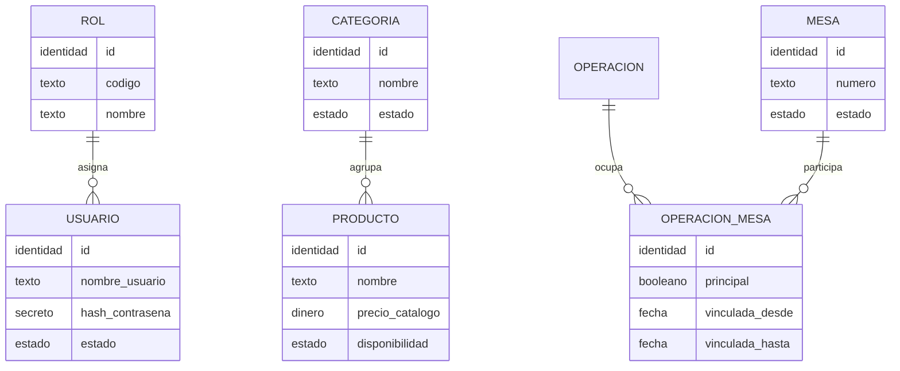
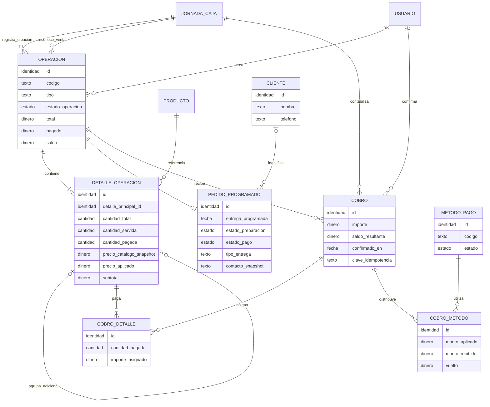
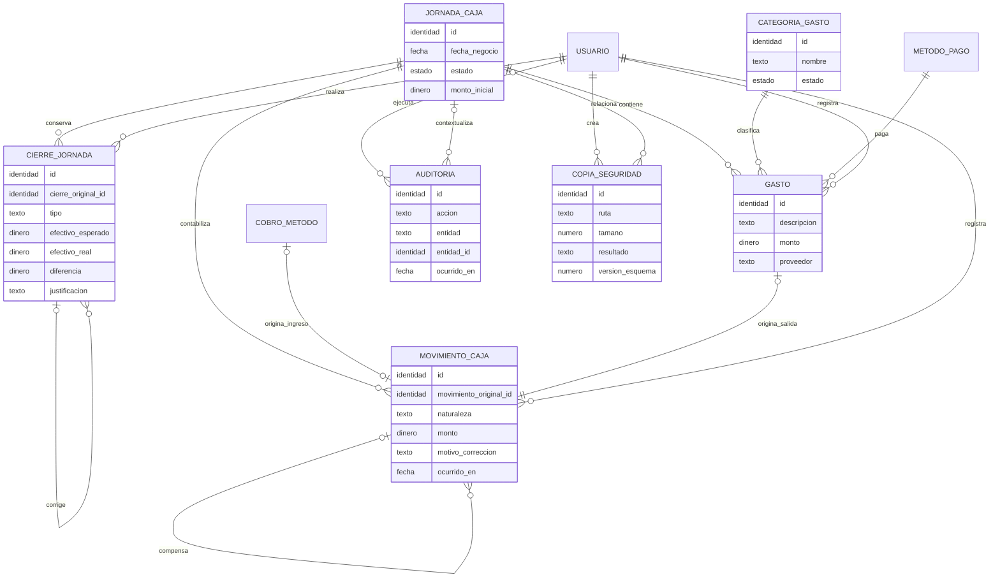

# Modelo conceptual de datos

## 1. Estado y alcance

- Estado: **aprobado para continuar con el esquema lógico**.
- Versión: 0.3.0.
- Fecha: 2026-07-29.
- Alcance: entidades, responsabilidades, relaciones, estados e invariantes conceptuales.
- Fuera de alcance: nombres físicos de tablas y columnas, tipos SQLite, SQL, índices y migraciones.

Este modelo preserva el historial económico, permite pagos por cantidades concretas y separa el estado financiero de los estados de atención, preparación y disponibilidad.

## 2. Principios del modelo

1. `Operacion` es la raíz común de una venta rápida, una cuenta de mesa o un pedido programado.
2. Los importes se expresan en céntimos enteros y nunca como punto flotante.
3. Los cobros, gastos, movimientos de caja, cierres y auditorías son históricos: no se sobrescriben ni eliminan.
4. Un cobro confirmado se distribuye entre detalles concretos y uno o varios métodos de pago.
5. Un pedido programado puede abarcar varias jornadas; cada cobro pertenece a la jornada en que fue recibido.
6. Los valores de catálogo necesarios para reconstruir una venta se copian como instantáneas en el detalle.
7. Los totales almacenados son instantáneas controladas; se recalculan y validan dentro de la misma transacción.
8. Los reportes de caja usan la jornada del cobro o gasto; los reportes de ventas usan la jornada de finalización o entrega.
9. Las asociaciones de mesas conservan historial de unión y separación.
10. Las acciones sensibles generan auditoría y claves de idempotencia para evitar duplicados por doble toque.
11. Toda corrección económica es compensatoria, se relaciona con el registro original y conserva ambos registros.
12. Los estados de preparación y pago del pedido programado se almacenan y validan por separado.

## 3. Vista general por dominios

### 3.1 Identidad, catálogo y mesas



`OperacionMesa` permite una mesa principal y varias mesas vinculadas. Una mesa puede participar como máximo en dos cuentas abiertas simultáneas; cada cuenta conserva productos, pagos, saldo e historial independientes.

### 3.2 Operaciones y cobros



Un cobro de cuenta de mesa siempre debe tener asignaciones `CobroDetalle`. Un adelanto de pedido programado puede aplicarse al saldo general sin asignarse todavía a cantidades concretas.

Los adicionales son productos normales agregados mediante un detalle hijo. Conservan identificador, cantidad, precio, subtotal, estado, usuario, fecha y relación con el detalle principal. No se guardan únicamente como texto.

### 3.3 Caja, auditoría y soporte



Cada movimiento tendrá exactamente un origen: distribución de cobro, gasto o corrección administrativa explícita. Una corrección solo puede crearla un administrador, debe relacionarse con el movimiento o registro original y nunca modifica ni elimina el original.

`CierreJornada` es un historial de cierres, no un único registro sobrescribible. Una reapertura conserva el cierre anterior, registra motivo, administrador, fecha y hora, genera auditoría y termina posteriormente en un nuevo cierre relacionado.

Ejemplo de corrección de un gasto:

```text
Movimiento original:  SALIDA              S/50
Movimiento relacionado: ENTRADA_CORRECTIVA S/20
Resultado neto del gasto:                  S/30
```

Los dos movimientos permanecen visibles. El importe se almacena siempre como valor no negativo; la naturaleza del movimiento determina si suma o resta.

## 4. Catálogo de entidades

### Identidad y permisos

| Entidad   | Responsabilidad                               |
| --------- | --------------------------------------------- |
| `Rol`     | Identificar `ADMINISTRADOR` y `CAJERO`.       |
| `Usuario` | Credenciales protegidas, estado activo y rol. |

Los permisos concretos permanecerán centralizados en el dominio. No se propone una tabla configurable de permisos para la primera versión.

### Catálogo

| Entidad     | Responsabilidad                                                                                    |
| ----------- | -------------------------------------------------------------------------------------------------- |
| `Categoria` | Agrupar productos y controlar su visibilidad.                                                      |
| `Producto`  | Nombre actual, precio de catálogo, disponibilidad y activación. Incluye adicionales configurables. |

Los productos históricos no se eliminan físicamente. El detalle conserva instantáneas de nombre, categoría y precios para que un cambio de catálogo no altere operaciones anteriores.

### Mesas y operaciones

| Entidad            | Responsabilidad                                                                                      |
| ------------------ | ---------------------------------------------------------------------------------------------------- |
| `Mesa`             | Número y estado de configuración.                                                                    |
| `OperacionMesa`    | Historial de mesas principal, vinculadas y liberadas de una cuenta.                                  |
| `Operacion`        | Raíz económica común y totales de venta rápida, cuenta de mesa o pedido programado.                  |
| `DetalleOperacion` | Producto, cantidades, servicio, pago, precios, descuento, motivo y notas.                            |
| `PedidoProgramado` | Datos exclusivos de entrega, contacto y preparación futura.                                          |
| `Cliente`          | Referencia opcional reutilizable; el pedido conserva además una instantánea obligatoria de contacto. |

`Operacion` mantiene la jornada de creación y la jornada de reconocimiento de la venta. Los cobros mantienen su propia jornada, lo que permite recibir adelantos en días diferentes sin atribuir todo el dinero a la jornada de registro.

Al separar mesas no se dividen productos ni pagos. Se finaliza la asociación activa de la mesa liberada, la cuenta continúa en la principal y la mesa liberada puede recibir una cuenta nueva.

### Cobros

| Entidad        | Responsabilidad                                                              |
| -------------- | ---------------------------------------------------------------------------- |
| `Cobro`        | Acción atómica e inmutable de cobrar, incluido el saldo resultante.          |
| `CobroDetalle` | Cantidades e importes concretos pagados de cada detalle.                     |
| `MetodoPago`   | Métodos configurables y activables, inicialmente efectivo y Yape.            |
| `CobroMetodo`  | Distribución de un cobro entre métodos, incluido efectivo recibido y vuelto. |

El historial de cobros se conserva. Los estados visuales “en edición” no se persisten como cobros incompletos. En cuentas de mesa todo pago se asigna a productos o cantidades concretas; el adelanto libre se admite únicamente en pedidos programados.

### Jornada y caja

| Entidad          | Responsabilidad                                                                          |
| ---------------- | ---------------------------------------------------------------------------------------- |
| `JornadaCaja`    | Fecha de negocio, apertura, monto inicial y estado vigente.                              |
| `CierreJornada`  | Instantánea inmutable de cada cierre, relacionada con el cierre anterior cuando corrige. |
| `MovimientoCaja` | Libro de movimientos por método y jornada, incluidas correcciones compensatorias.        |
| `Gasto`          | Salida registrada por usuario, jornada y método de pago.                                 |
| `CategoriaGasto` | Clasificación consistente para gastos y reportes.                                        |

### Soporte

| Entidad          | Responsabilidad                                                                 |
| ---------------- | ------------------------------------------------------------------------------- |
| `Auditoria`      | Acción, usuario, entidad, valores anterior/nuevo, motivo y contexto de jornada. |
| `Configuracion`  | Valores configurables de la aplicación que no justifican una entidad propia.    |
| `SchemaVersion`  | Versión aplicada del esquema SQLite.                                            |
| `CopiaSeguridad` | Metadatos y resultado de copias manuales o automáticas.                         |

## 5. Estados separados

### Estado financiero de operación

```text
ABIERTA
PAGADA_PARCIALMENTE
PAGADA
FINALIZADA
ANULADA
```

El estado `PAGADA` no finaliza una cuenta de mesa. Si se agregan nuevos productos después de llegar a saldo cero, la operación vuelve a `PAGADA_PARCIALMENTE` porque conserva pagos y adquiere saldo pendiente.

### Estado de servicio del detalle

```text
PENDIENTE
SERVIDO
```

### Estado de preparación del pedido programado

```text
REGISTRADO
PENDIENTE_DE_PREPARACION
EN_PREPARACION
LISTO
ENTREGADO
ANULADO
```

### Estado de pago del pedido programado

```text
SIN_ADELANTO
CON_ADELANTO
PAGADO_PARCIALMENTE
PAGADO
PENDIENTE_DE_PAGO
PAGO_BLOQUEADO_REVISION
```

Preparación y pago se almacenan por separado. El estado de pago debe ser coherente con `pagado` y `saldo`: `SIN_ADELANTO` representa cero pagado antes de ser exigible; `CON_ADELANTO` representa un adelanto con saldo antes de la entrega; `PAGADO_PARCIALMENTE` representa otros pagos incompletos; `PENDIENTE_DE_PAGO` indica que el pago ya es exigible; y `PAGADO` exige saldo cero. `PAGO_BLOQUEADO_REVISION` requiere motivo y auditoría.

### Estado de jornada

```text
ABIERTA
CERRADA
```

La reapertura es una acción administrativa auditada que cambia el estado vigente sin eliminar el cierre anterior.

## 6. Relaciones y cardinalidades críticas

1. Un rol tiene muchos usuarios; cada usuario tiene un rol.
2. Una categoría tiene muchos productos; cada producto tiene una categoría.
3. Una operación tiene uno o más detalles.
4. Una cuenta de mesa tiene una o más asociaciones activas con mesas y exactamente una mesa principal.
5. Una mesa puede participar como máximo en dos cuentas abiertas simultáneas.
6. Solo una operación de tipo pedido programado tiene su extensión `PedidoProgramado`.
7. Una operación recibe cero o muchos cobros confirmados.
8. Un cobro usa uno o más métodos y puede asignarse a varios detalles.
9. Una jornada contabiliza operaciones creadas, ventas reconocidas, cobros recibidos, gastos, movimientos y uno o varios cierres históricos.
10. Un gasto confirmado genera un movimiento; cada parte de cobro confirmada genera el movimiento correspondiente a su método.
11. Una auditoría pertenece a un usuario y puede pertenecer a una jornada.
12. Un movimiento compensatorio se relaciona con un movimiento o registro económico original.
13. Un cierre corregido se relaciona con el cierre anterior y no lo reemplaza físicamente.

## 7. Invariantes económicas

```text
cantidad_servida <= cantidad_total
cantidad_pagada <= cantidad_total
subtotal_detalle >= 0
total_operacion >= 0
pagado_operacion >= 0
saldo_operacion = total_operacion - pagado_operacion
importe_cobro = suma(cobro_detalles)
importe_cobro = suma(montos_aplicados)
vuelto = efectivo_recibido - efectivo_aplicado
```

Excepción controlada: en un adelanto de pedido programado todavía no asignado a detalles, el importe del cobro se valida contra el saldo de la operación y no contra `CobroDetalle`.

Reglas adicionales:

- No se confirma un cobro que exceda el saldo seleccionado.
- El efectivo recibido puede superar el efectivo aplicado únicamente por el vuelto.
- Una cuenta se finaliza solo con saldo cero y todos sus detalles pagados.
- Una venta rápida se guarda, cobra, mueve caja y finaliza en una sola transacción.
- Una operación finalizada no acepta modificaciones.
- Una jornada no cierra con mesas abiertas, cuentas pendientes o diferencia sin justificar.
- Los pedidos programados futuros no bloquean el cierre, pero sus cobros pertenecen a las jornadas en que ocurrieron.
- La fecha y hora de cierre se generan automáticamente al confirmar.
- Un cajero no puede modificar un cierre confirmado.
- Solo el administrador puede reabrir, corregir y crear movimientos compensatorios.
- El efectivo esperado incluye el efecto neto de movimientos originales y compensatorios.
- El reporte de ventas reconoce cada operación exactamente una vez en su jornada de finalización o entrega.
- Un pedido programado con adelanto no puede anularse mientras la política del dinero siga pendiente.

### Invariantes de adicionales

- Un adicional pertenece a un único detalle principal de la misma operación.
- Su subtotal forma parte del total de la operación.
- Si se elimina el principal antes de servirlo, sus adicionales se eliminan en la misma transacción.
- Un principal servido y sus adicionales respetan las reglas de bloqueo y auditoría.

## 8. Prevención de duplicados

Las acciones críticas tendrán una clave de idempotencia generada al comenzar la confirmación:

- Cobrar.
- Crear venta rápida.
- Registrar gasto.
- Cerrar jornada.
- Crear respaldo.

Repetir la misma confirmación devolverá el resultado existente y no generará otro cobro o movimiento.

## 9. Decisiones aprobadas

1. Los registros económicos originales son inmutables; las correcciones son compensatorias y relacionadas.
2. El cajero puede justificar una diferencia al cerrar, pero no modificar el cierre confirmado.
3. Solo el administrador puede reabrir, corregir y confirmar un nuevo cierre relacionado.
4. Separar mesas libera asociaciones físicas sin dividir consumos o pagos existentes.
5. Los pagos separados de mesa siempre seleccionan productos o cantidades concretas.
6. Los adicionales son detalles hijos con producto, cantidad, precio y subtotal propios.
7. Los pedidos programados separan estado de preparación y estado de pago.
8. Cada adelanto es un cobro con jornada, método, usuario, fecha, hora y saldo resultante.
9. Caja se reporta por jornada del movimiento; ventas por jornada de finalización o entrega.
10. Las operaciones finalizadas permanecen en solo lectura; cualquier corrección económica es compensatoria.
11. Todo descuento se asigna a detalles y cantidades concretas mediante su precio unitario aplicado; no existe descuento global sin asignación.
12. `SIN_ADELANTO` y `CON_ADELANTO` se usan antes de la exigibilidad; `PENDIENTE_DE_PAGO` y `PAGADO_PARCIALMENTE` cuando el saldo ya es exigible; `PAGADO` exige saldo cero y la revisión bloqueada exige motivo.
13. Cada corrección representa por separado su impacto sobre caja y venta mediante `SUMA`, `RESTA` o `SIN_EFECTO` y un monto positivo; solo el administrador puede crearla.

### Política pendiente y bloqueo aprobado

La política del adelanto al anular un pedido programado sigue pendiente. Hasta definir devolución, retención, transferencia o saldo a favor:

- No se confirma la anulación si existe un adelanto.
- No se crean devoluciones ni movimientos automáticos.
- El pedido, sus cobros y su saldo permanecen sin cambios.
- La interfaz muestra una advertencia y solicita una decisión administrativa.

Mensaje aprobado como referencia:

```text
Este pedido tiene un adelanto registrado.
No puede anularse hasta definir si el dinero será devuelto o retenido.
Solicite la decisión del administrador.
```

## 10. Casos límite cubiertos por el modelo

- Doble toque al cobrar mediante idempotencia.
- Cierre inesperado mediante transacciones cortas.
- Pago de cantidades parciales sin duplicar detalles.
- Cuenta que llega a cero y recibe nuevos productos.
- Varias cuentas simultáneas en una mesa.
- Una cuenta asociada a varias mesas.
- Pedido programado con cobros en jornadas diferentes.
- Pago combinado con vuelto solo en efectivo.
- Productos desactivados sin pérdida del historial.
- Reapertura de jornada sin sobrescribir cierres anteriores.
- Corrección de gasto, cobro o caja mediante movimiento compensatorio relacionado.
- Separación de una mesa sin dividir la cuenta conjunta.
- Caja y venta reconocidas en jornadas diferentes sin duplicar la operación.
- Auditoría de cambios de precio, descuentos, cierres y ajustes.

## 11. Criterios de aceptación

- El modelo representa los tres tipos de operación sin duplicar la lógica económica.
- Los pagos separados se relacionan con cantidades concretas.
- Los pagos combinados conservan cada método y el vuelto.
- Las mesas unidas comparten una sola cuenta y una mesa principal.
- Los pedidos programados pueden abarcar varias jornadas.
- Los estados financieros, de servicio y preparación no se mezclan.
- El historial económico y de cierres no se sobrescribe.
- Las correcciones se relacionan con los registros originales.
- Los reportes separan ingreso de dinero y reconocimiento de la venta.
- Los descuentos se pueden atribuir sin ambigüedad a las cantidades pagadas.
- Las correcciones expresan por separado sus efectos de caja y venta.
- La anulación con adelanto permanece bloqueada hasta aprobar su política.
- El esquema lógico se documenta por separado; no se ha escrito SQL ni creado ninguna migración.

## 12. Continuación del diseño

El esquema lógico propuesto está en [`docs/ESQUEMA_LOGICO_SQLITE.md`](ESQUEMA_LOGICO_SQLITE.md). Debe revisarse y aprobarse antes de elegir el plugin SQLite y escribir la migración inicial.
